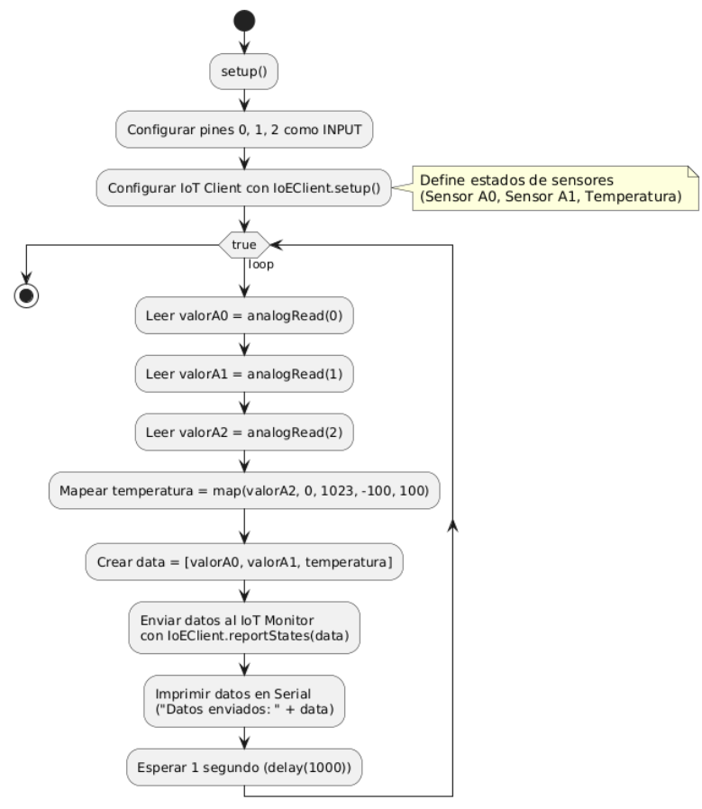

# Reinforcement-Activity-2.2
## Valentina Ruiz, Tomas Barrios, Darek Aljuri, Rafael Salcedo
# Wiki del Proyecto IoT para Máquinas Expendedoras

## Resumen del Diseño
En este proyecto, diseñamos y validamos un componente de conectividad para nuestra aplicación IoT enfocada en máquinas expendedoras. Nuestro objetivo es mejorar la gestión y monitoreo de las máquinas mediante sensores que midan el peso del producto, la temperatura de las bebidas y las variaciones de voltaje. Estos datos permiten optimizar la reposición de productos, garantizar la calidad de las bebidas y prevenir daños por picos de energía.

Además, implementamos un tablero de control que recibe alertas en tiempo real desde los sensores a través del protocolo MQTT. De igual manera, se implementó el servicio IoT para el monitoreo de los datos en tiempo real. De esta manera, se puede visualizar información clave sobre el estado de la máquina expendedora y genera alertas en caso de eventos críticos, facilitando la supervisión y el mantenimiento preventivo.

## Tipo de Red

Seleccionamos **Wi-Fi** como la red principal para la conectividad de nuestras máquinas expendedoras inteligentes debido a su accesibilidad, costo y compatibilidad con múltiples dispositivos IoT. La infraestructura existente en la universidad garantiza una conexión estable a internet y acceso a energía eléctrica, eliminando la necesidad de instalar redes adicionales o depender de servicios celulares costosos.

De acuerdo con el artículo consultado "Cellular vs WiFi for IoT: Choosing the Best Connectivity Option", la elección entre redes celulares y Wi-Fi depende del entorno de implementación y los requisitos de conectividad. Si bien las redes celulares ofrecen mayor cobertura y movilidad, Wi-Fi resulta más rentable y adecuado para aplicaciones localizadas, como en nuestro caso, donde las máquinas expendedoras están en un espacio fijo con acceso a una infraestructura estable de red y energía [6].

Además, el artículo menciona que Wi-Fi es ideal para dispositivos IoT en ubicaciones fijas, como almacenes o equipos industriales, lo que refuerza nuestra elección para las máquinas expendedoras inteligentes. Dado que la universidad ya cuenta con puntos de acceso Wi-Fi, esta opción permite la conexión directa de los dispositivos sin incurrir en costos adicionales por certificaciones o planes de datos móviles, según Eseye "Wi-Fi offers fewer benefits in terms of mobility as the IoT devices will require additional infrastructure such as routers, gateways, or repeaters, that would all need to be pre-configured"[6].

La infraestructura preexistente dentro del campus universitario facilita la implementación de Wi-Fi como la mejor opción para nuestras máquinas expendedoras inteligentes, garantizando estabilidad, eficiencia de costos y compatibilidad con la red actual.


## Requisitos del Sistema

#### ***Requisitos Funcionales***  
1. **Conectividad IoT**: La máquina expendedora debe conectarse a una red mediante Wi-Fi para transmitir y recibir datos en tiempo real.  
2. **Protocolo de Comunicación**: El sistema debe utilizar MQTT para la comunicación eficiente entre dispositivos y servidores.  
3. **Monitoreo Remoto**: Se debe permitir el monitoreo en tiempo real de los sensores instalados en la máquina (temperatura, stock, estado de funcionamiento).  
4. **Gestión de Dispositivos**: El sistema debe permitir la administración remota de la máquina, incluyendo actualizaciones de firmware y control de disponibilidad de productos.  
5. **Registro de Datos**: Debe almacenarse un historial de datos sobre el funcionamiento de la máquina y el estado del inventario.  
6. **Interfaz de Usuario**: Debe existir una interfaz gráfica para que los administradores puedan visualizar la información de las máquinas.  

#### ***Requisitos No Funcionales***  
1. **Disponibilidad**: El sistema debe garantizar una disponibilidad del 99% para asegurar el funcionamiento ininterrumpido de la máquina.  
2. **Escalabilidad**: Debe permitir la integración de múltiples máquinas en la misma red sin afectar el rendimiento.  
3. **Eficiencia Energética**: Los sensores y módulos de comunicación deben consumir poca energía para prolongar la vida útil de la máquina.  
4. **Interoperabilidad**: Compatible con diferentes tipos de sensores y sistemas de gestión remota.  
5. **Baja Latencia**: El tiempo de respuesta entre la solicitud y la respuesta del sistema no debe superar los 500 ms.  
6. **Seguridad**: La comunicación debe estar protegida mediante cifrado y autenticación para evitar accesos no autorizados.  

### *Restricciones del Sistema*  

1. **Limitaciones de Hardware**: El sistema debe operar con los sensores y módulos disponibles en el mercado, sin requerir componentes personalizados costosos.  
2. **Infraestructura de Red**: Depende de la disponibilidad de redes Wi-Fi estables en las ubicaciones donde se instalen las máquinas expendedoras.  
3. **Consumo de Datos**: La comunicación debe ser eficiente en términos de datos para minimizar costos de conectividad.  
4. **Seguridad y Regulaciones**: Debe cumplir con normativas de seguridad y privacidad de datos, como GDPR o normativas locales.  
5. **Capacidad de Almacenamiento**: La memoria de la máquina para almacenar datos localmente es limitada, por lo que debe priorizarse el envío de datos al servidor.  
6. **Costo de Implementación**: El diseño debe ser viable económicamente para que la integración del IoT en las máquinas sea rentable.  
7. **Compatibilidad con Cisco Packet Tracer**: La simulación y validación deben realizarse en Cisco Packet Tracer, lo que puede limitar algunos aspectos del diseño.

## Protocolos Utilizados

### MQTT (Message Queuing Telemetry Transport)
- Protocolo ligero y eficiente, ideal para la comunicación entre dispositivos IoT.
- Facilita la transmisión de datos en tiempo real con un consumo mínimo de ancho de banda.
- Se utilizará para el envío de datos desde los sensores al servidor central.

- **Publicadores:** La SBC transmite los datos de los sensores al servidor.  
- **Broker MQTT:** El servidor recibe y distribuye los datos.  
- **Suscriptores:** La tablet y demás dispositivos reciben actualizaciones.  

 **Ventajas:**  
- Consumo bajo de ancho de banda.  
- Eficiencia en la transmisión de datos en redes IoT.  
- Comunicación basada en eventos (solo se envían datos cuando hay cambios).  

###  TCP (Transmission Control Protocol)  
 **Función:** Se usa para la comunicación confiable de los datos entre el servidor y los dispositivos IoT.  

- **Se usa cuando es necesario asegurar que los datos lleguen correctamente.**  
- **Requiere una conexión establecida antes de la transmisión de datos.**  

 **Ventajas:**  
- Garantiza que los mensajes lleguen sin errores y en orden.  
- Es útil para la configuración de dispositivos y transmisión de comandos críticos.  

### **STP (Spanning Tree Protocol)**
- Protocolo utilizado para evitar **bucles en la red** cuando hay múltiples caminos de conexión.
- Se encarga de deshabilitar enlaces redundantes y solo activa rutas seguras para la comunicación.

#### **Funcionamiento en la simulación:**
- Se usa en la red de la simulación para **evitar bucles** en la comunicación entre el servidor, la pasarela (gateway) y los dispositivos IoT.  
- Si hay múltiples caminos entre dispositivos, STP selecciona **el mejor camino** y bloquea los enlaces redundantes.  
- Permite la **recuperación automática** en caso de que un enlace principal falle.  

#### **Ventajas:**
- Evita colisiones y congestión en la red.  
- Mejora la estabilidad y confiabilidad de la comunicación en IoT.  
- Permite una **red dinámica y adaptable** en caso de fallos.  

## Sensores y Proceso de Sensado
Para lograr una correcta recolección de datos, los sensores están conectados a un **Single Board Computer (SBC Board)**, que procesa la información y la envía al servidor. 

### Internet of Everything (IoE)
El **Internet of Everything (IoE)** amplía el concepto de IoT al conectar no solo dispositivos, sino también **personas, procesos y datos** en una red inteligente. En nuestro proyecto, el uso de IoE se refleja en:
- La interconexión entre sensores, SBC Board y el servidor a través de MQTT.
- La integración del tablero de control para el monitoreo en tiempo real.
- La toma de decisiones automatizadas en función de los datos recibidos.

Para lograr esta integración, configuramos la API de IoE en Cisco Packet Tracer, lo que permite:

- Definir el tipo de dispositivo en la red.
- Gestionar los estados de los sensores (peso, temperatura, voltaje).
- Establecer unidades de medida y conversiones.
- Permitir el control remoto desde el servidor IoE.

De acuerdo con la documentación de IoE, cada dispositivo define sus estados con propiedades como tipo, unidad de medida y controlabilidad remota. Esto facilita la comunicación eficiente con el servidor y la visualización de datos en tiempo real.[3] El **IoE Client**, implementado en el **SBC Board**, permite una comunicación eficiente con el servidor, asegurando que todos los elementos del sistema trabajen de manera coordinada.

### Razón por la que no se utilizó un Microcontrolador (MCU)
Inicialmente, consideramos el uso de un **MCU Board**, pero lo descartamos debido a limitaciones en la implementación del protocolo MQTT,asi como la integración con la API IoE de Packet Tracer. Los microcontroladores, aunque eficientes para tareas específicas de sensado, requieren librerías y configuraciones adicionales para soportar MQTT e IoE, lo que complicaba la implementación en nuestro caso. En cambio, el **SBC Board** proporciona mayor capacidad de procesamiento y compatibilidad con herramientas necesarias para la comunicación IoT, incluyendo soporte nativo para MQTT. "Un SCBS es una computadora de placa única tipicamente usados para conectar componentes IOT." [2]

### Sensores Implementados y Funcionamiento
- **Sensor de Peso (simulado con potenciómetro):** Se encarga de medir el peso de los productos dentro de la máquina expendedora. La lectura del sensor se compara con valores anteriores para determinar si hubo consumo y garantizar que se realice la reposición adecuada.
- **Sensor de Voltaje (simulado con potenciómetro):** Detecta fluctuaciones en la corriente eléctrica. Si hay una caída o un pico de voltaje, el sistema lo registra y envía una alerta al servidor para que los técnicos puedan actuar a tiempo.
- **Sensor de Temperatura ():** Controla la temperatura de las bebidas calientes, asegurando que se mantengan dentro de un rango adecuado antes de ser dispensadas. Si la temperatura no está en el umbral correcto, se puede generar una alerta para mantenimiento.

### Single Board Computer (SBC Board)
- El SBC Board lee periódicamente los valores de los sensores.
- Procesa los datos para identificar patrones anómalos.
- Utiliza Wi-Fi para enviar las alertas al servidor central mediante MQTT y los datos en tiempo real al servicio de monitoreo IoT mediante TCP.

### Comunicación con el Tablero de Control
Para una supervisión eficiente, el sistema incluye un **tablero de control** que muestra en tiempo real los datos de los sensores y envía alertas cuando sea necesario.

Con esta integración de IoE, se optimiza la comunicación y la toma de decisiones en el sistema, mejorando la eficiencia y el mantenimiento preventivo de las máquinas expendedoras.

### Implementación de MQTT
Para implementar MQTT en un dispositivo intermediario, en nuestro caso un servidor, es necesario abrir el Administrador de Aplicaciones de Usuario desde el escritorio y esperar a que se cargue completamente. En este punto, se podrá visualizar la aplicación del broker MQTT y la aplicación de cliente MQTT en la interfaz gráfica.

"Una vez dentro del Administrador de Aplicaciones de Usuario, se debe seleccionar el broker, hacer clic en "Instalar", cerrar el Administrador y verificar que el icono del MQTT Broker aparezca en el escritorio. Desde allí, es posible iniciarlo y configurar los parámetros necesarios"[4].

Para configurar los clientes MQTT, el procedimiento es similar al del broker, con algunas diferencias en los pasos previos. Al acceder a la configuración del dispositivo IoT, por defecto no se mostrará el escritorio en la interfaz. "Para habilitarlo, es necesario hacer clic en el botón "Avanzado" y cambiar el modo de visualización. Luego, en la pestaña Configuración de E/S, se debe marcar la opción Escritorio, lo que habilitará una nueva pestaña del mismo nombre en la barra de navegación superior"[4].

Desde este punto, se puede proceder de manera similar a la instalación del broker, con la diferencia de que en este caso se instalará el Cliente MQTT en lugar del servidor【4】.

En este caso, el servidor funciona como Broker MQTT, y los clientes son la tablet y la SBC. En la tablet se observan las alertas en caso de cambios drásticos en la lectura de las variables, mientras que en la SBC se configuró el siguiente script en python para la automatización de la publicación de las alertas.

```
previous_values = {"A0": None, "A1": None, "Temp": None}
def map_temperature(value):
    return (value / 1023.0) * 200 - 100  # Mapea de 0-1023 a -100 a 100
    
def mypublish0():
    global previous_values
    a = analogRead(0)
    if previous_values["A0"] is None or abs(a - previous_values["A0"]) > 200:
        topic = "ControlA0"
        payload = "ALERTA! La variable A0 cambio su valor drasticamente de " + str(previous_values["A0"]) + " a " + str(a)
        qos = "1"
        mqttclient.publish(topic, payload, qos)
        print payload
    previous_values["A0"] = a

def mypublish1():
    global previous_values
    a = analogRead(1)
    if previous_values["A1"] is None or abs(a - previous_values["A1"]) > 200:
        topic = "ControlA1"
        payload = "ALERTA! La variable A1 cambio su valor drasticamente de " + str(previous_values["A1"]) + " a " + str(a)
        qos = "1"
        mqttclient.publish(topic, payload, qos)
        print payload
    previous_values["A1"] = a

def mypublishtemp():
    global previous_values
    a_raw = analogRead(2)
    a = map_temperature(a_raw)
    if previous_values["Temp"] is None or abs(a - previous_values["Temp"]) > 5:
        topic = "ControlTemp"
        payload = "ALERTA! La variable Temp cambio su valor drasticamente de " + str(previous_values["Temp"]) + " a " + str(a)
        qos = "1"
        mqttclient.publish(topic, payload, qos)
        print payload
    previous_values["Temp"] = a
```

En esta simulación, se realiza una comparación periódica entre el valor actual y el anterior. Se ha definido un umbral de 200 para los potenciómetros y de 3° para la temperatura, con el objetivo de simplificar las pruebas y centrarse en la efectividad de las alertas mediante MQTT. Si la variación supera estos límites, se enviará una notificación a los suscriptores del tópico correspondiente. Para la implementación real, es fundamental analizar las condiciones ambientales y ajustar los umbrales según los requisitos del sistema.


## Proceso de Validación
### Uso de Cisco Packet Tracer
Para validar nuestra conectividad, seguimos estos pasos en Cisco Packet Tracer:

1. **Configuración de la Simulación:** Creación de un proyecto en Cisco Packet Tracer con los dispositivos IoT requeridos.
2. **Implementación del Diseño:** Conexión de los dispositivos según nuestro plan, asegurando que la configuración de red sea correcta.
3. **Pruebas de Conectividad:** Evaluación de la comunicación entre dispositivos mediante la simulación de transmisión de datos.

### Descripción del Circuito en Cisco Packet Tracer
El siguiente diagrama representa la implementación de nuestra solución IoT en Cisco Packet Tracer:


**Componentes del Circuito:**
- **Servidor (Server-PT)**: Responsable del procesamiento y almacenamiento de los datos recibidos desde los sensores.
- **Home Gateway (SLC100)**: Punto de acceso Wi-Fi que conecta todos los dispositivos IoT con el servidor.
- **Tablet-PC**: Representa la interfaz de usuario para el monitoreo remoto de los datos.
- **SBC Board (Control0)**: Dispositivo que recibe datos de los sensores, los procesa y los envía al servidor mediante MQTT.
- **Sensores:**
  - **Sensor de Temperatura (IoT2)**: Mide la temperatura de las bebidas y envía datos al SBC Board.
  - **Potenciómetros (IoT0, IoT1)**: Simulan los valores de peso y voltaje debido a la falta de sensores específicos en Packet Tracer.
    
### Simulación en Cisco Packet Tracer y funcionamiento
A continuación, se presenta una captura de la simulación en Cisco Packet Tracer:


####  Flujo de Datos en la Red IoT  

1. **Los sensores recogen datos**  
   - El **sensor de temperatura (IoT2)** mide la temperatura de la máquina expendedora.  
   - Los **potenciómetros (IoT0 e IoT1)** simulan sensores de peso y voltaje, registrando cambios en los productos disponibles y en la corriente eléctrica.  
   - Estos sensores están conectados a un **SBC Board (Control0)**, que actúa como controlador.  

2. **Transmisión de datos mediante IoT TCP**  
   - El SBC Board **publica** los datos de los sensores utilizando el **protocolo IoT TCP** a través de la **puerta de enlace Wi-Fi (Home Gateway - SLC100)**.  
   - La puerta de enlace envía estos datos al **servidor central (Server-PT)**.  
   - El servidor mediante el servicio IoT recibe los datos y los **monta** en la app de monitoreo, la **Tablet-PC**, que visualiza la información en tiempo real mediante IoT Monitor.  

3. **Interacción con la Tablet-PC**  
   - La **Tablet-PC (Tablet PC0)** está suscrita a los tópicos MQTT del servidor, por lo que **recibe actualizaciones** cuando los sensores detectan cambios.  
   - Si la temperatura de la máquina es demasiado baja o alta, o si hay fluctuaciones de voltaje peligrosas, la tablet **muestra alertas** para que los técnicos puedan intervenir.  

4. **Transmisión de eventos y control del sistema**  
   - Cuando el SBC Board detecta eventos críticos, como un cambio brusco en el voltaje, puede enviar una alerta utilizando **mensajes MQTT**.
   
### Formato de los Mensajes MQTT
La Tablet-PC muestra mensajes en formato JSON, que es el estándar en MQTT para el intercambio de datos. Los mensajes tienen la siguiente estructura:

          {
            "topic": "ControlIA0",
            "payload": "¡ALERTA! La variable A0 cambió su valor drásticamente de 0 a 1023"
          }

***Explicación del mensaje:***

- "topic" → Define la categoría o canal donde se publica el mensaje. En este caso, "ControlIA0", que representa un sensor o grupo de sensores.

- "payload" → Contiene la información transmitida. Aquí se reporta que la variable "A0" sufrió un cambio brusco en su valor
  


***Análisis de los Mensajes Recibidos***
- El sensor A0 pasó de 0 a 1023, lo que indica un cambio súbito en su medición.

- Luego, la variable A1 cambió de 0 a 534, lo que podría significar un ajuste en otro sensor.

- Finalmente, A0 cambió nuevamente de 1023 a 558, indicando otra variación significativa.
  


###  Resumen del Funcionamiento de la Red  

- **Sensores** → Recogen datos y los envían al SBC Board.  
- **SBC Board (Control0)** → Publica alertas mediante MQTT y datos mediante TCP a través del Home Gateway.  
- **Home Gateway (SLC100)** → Transmite los datos al servidor central.  
- **Servidor (Server-PT)** → Actúa como el broker MQTT y servicio IoT para las distribución de datos.  
- **Tablet-PC** → Se suscribe a los datos y permite monitorear el sistema en tiempo real.  

Con esta arquitectura, logramos una red eficiente para la gestión y monitoreo de las máquinas expendedoras, asegurando un control óptimo y la prevención de fallos en el sistema. 


## Código para Obtener y Reportar Datos de Sensores al IoT Monitor


Este programa está diseñado para leer datos de tres sensores (dos potenciómetros que simulan sensores de voltaje y un sensor de temperatura), procesarlos y enviarlos al **IoT Monitor** utilizando la API **IoE (Internet of Everything)** de **Packet Tracer**.  

El código configura los pines de entrada, define los estados de los sensores, mapea los valores de temperatura y reporta los datos periódicamente.


####  **Entorno**
- **Dispositivo:** SBC Board (**Control0**)  
- **Lenguaje:** JavaScript (usado por la API IoE en Packet Tracer)  

#### **Sensores Simulados**
1. **Sensor A0** (*Potenciómetro IoT0*): Simula un sensor de voltaje.  
2. **Sensor A1** (*Potenciómetro IoT1*): Simula otro sensor de voltaje.  
3. **Sensor A2** (*Temperature Sensor IoT2*): Simula un sensor de temperatura.  


#### **Funcionalidad Principal**
- **Configuración de Pines:** Se establecen los pines de entrada para leer valores analógicos de los sensores.  
- **Definición de Estados:** Se asignan los valores de voltajes y temperatura mediante la API IoE.  
- **Lectura de Sensores:** Se obtienen los valores de los sensores en tiempo real.  
- **Mapeo de Temperatura:** Se transforma el valor del sensor de temperatura a un rango de **-100°C a 100°C**.  
- **Reporte Periódico:** Se envían los datos al **IoT Monitor** cada segundo.  

            // Configuración inicial del programa
            function setup() {
                // Configurar los pines 0, 1 y 2 como entradas para leer los sensores
                pinMode(0, INPUT);  // Sensor A0 (Potenciómetro IoT0 - Voltaje)
                pinMode(1, INPUT);  // Sensor A1 (Potenciómetro IoT1 - Voltaje)
                pinMode(2, INPUT);  // Sensor A2 (Temperature Sensor IoT2 - Temperatura)
                
                // Configuración del IoT Client usando la API IoE
                IoEClient.setup({
                    type: "SensorBoard",  // Tipo de dispositivo
                    states: [  // Definición de los estados de los sensores
                        { name: "Sensor A0", type: "number", unit: "V" },  // Voltaje en A0
                        { name: "Sensor A1", type: "number", unit: "V" },  // Voltaje en A1
                        { 
                            name: "Temperatura", 
                            type: "number", 
                            unit: "°C",  // Unidad métrica
                            imperialUnit: "°F",  // Unidad imperial
                            toImperialConversion: "x * 1.8 + 32",  // Conversión a °F
                            toMetricConversion: "(x - 32) / 1.8",  // Conversión a °C
                            decimalDigits: 1  // Un decimal para la temperatura
                        }
                    ]
                });
            }
            
            // Bucle principal que se ejecuta continuamente
            function loop() {
                // Leer los valores analógicos de los sensores (rango: 0 a 1023)
                var valorA0 = analogRead(0);  // Valor del sensor A0 (Voltaje)
                var valorA1 = analogRead(1);  // Valor del sensor A1 (Voltaje)
                var valorA2 = analogRead(2);  // Valor del sensor A2 (Temperatura)
            
                // Convertir el valor de A2 (0-1023) a un rango de temperatura (-100°C a 100°C)
                var temperatura = map(valorA2, 0, 1023, -100, 100);
            
                // Crear un arreglo con los datos de los sensores
                var data = [valorA0, valorA1, temperatura];
            
                // Enviar los datos al IoT Monitor usando la API IoE
                IoEClient.reportStates(data);
            
                // Imprimir los datos enviados en la consola serial para depuración
                Serial.println("Datos enviados: " + data.join(", "));
            
                // Esperar 1 segundo antes de la próxima lectura
                delay(1000);
            }
            
            // Función auxiliar para mapear un valor de un rango a otro
            function map(x, in_min, in_max, out_min, out_max) {
                // Fórmula de mapeo: (x - in_min) * (out_max - out_min) / (in_max - in_min) + out_min
                return (x - in_min) * (out_max - out_min) / (in_max - in_min) + out_min;
            }
            


### Explicación del Código

#### **Función `setup()`**
1. **Configuración de Pines**  
   - Los pines **0, 1 y 2** se configuran como **entradas** para leer los valores analógicos de los sensores.  
2. **Configuración del IoT Client**  
   - Se usa `IoEClient.setup()` para definir el tipo de dispositivo (**SensorBoard**) y los estados de los sensores:
     - **Sensor A0 y A1:** Representan **voltajes** (en voltios, `"V"`).
     - **Sensor A2 (Temperatura):** Representa la **temperatura** en °C, con conversión a °F para sistemas imperiales.  
     - Se especifica que los valores tendrán **un decimal** para mayor precisión.  

#### **Función `loop()`**
1. **Lectura de Sensores**  
   - Se obtienen los valores **analógicos** (rango **0 a 1023**) de los pines **0, 1 y 2** con `analogRead()`.  
2. **Mapeo de Temperatura**  
   - Se convierte el valor del **sensor A2** (**0 a 1023**) a un rango de **-100°C a 100°C** usando la función `map()`.  
3. **Reporte de Datos**  
   - Se crea un **arreglo** con los valores de los sensores (**valorA0, valorA1, temperatura**) y se envía al **IoT Monitor** con `IoEClient.reportStates()`.  
4. **Depuración**  
   - Se imprimen los datos enviados en la **consola serial** para monitoreo y verificación.  
5. **Retardo**  
   - Se espera **1 segundo** (`delay(1000)`) antes de la próxima iteración.  


#### **Función `map()`**
- **Propósito:**  
  - Es una **función auxiliar** que mapea un valor de **un rango a otro**.  
- **Uso en el Código:**  
  - Convierte el valor del **sensor de temperatura** (**0 a 1023**) a un rango de **-100°C a 100°C**.  

El programa se ejecuta en un bucle infinito: lee los sensores, procesa los datos (mapea la temperatura), los envía al IoT Monitor y espera 1 segundo antes de repetir el proceso.

### Diagrama de Flujo del Programa




### Diagrama Interacción entre Componentes (Diagrama de Secuencia)


## Pruebas y Validaciones

Para asegurar el correcto funcionamiento de nuestra red IoT en máquinas expendedoras, realizamos diversas pruebas en **Cisco Packet Tracer** para validar la transmisión de datos, la estabilidad de la conexión y la correcta detección de eventos críticos.  

### 1. Pruebas de Conectividad  
- Verificamos que los dispositivos IoT (sensores, SBC Board, broker MQTT y Tablet-PC) estuvieran correctamente conectados en la red Wi-Fi.  
- Realizamos pruebas de **ping** entre dispositivos para evaluar la latencia y disponibilidad de conexión.  
- Se probó la comunicación MQTT, asegurando que los **suscriptores** recibieran datos correctamente desde los **publicadores**.
- Se probó el funcionamiento del servicio y monitor Iot, cambiando el valor de los potenciómetros y viendo los cambios en tiempo real.

###  2. Pruebas de Comunicación MQTT  
- **Publicación y suscripción:** Evaluamos diferentes tópicos MQTT para garantizar que los mensajes fueran enviados y recibidos sin errores.  
- **Formatos de datos:** Validamos que los mensajes fueran transmitidos en **JSON** con una estructura clara.  

### 3. Pruebas de Simulación de Sensores  
Cisco Packet Tracer no cuenta con sensores específicos de **peso y voltaje**, por lo que realizamos las siguientes simulaciones:  
- **Sensor de peso:** Simulamos variaciones en la carga de productos con un potenciómetro.  
- **Sensor de voltaje:** Ajustamos manualmente el potenciómetro para simular cambios de voltaje y validar la detección de alertas.  
- **Sensor de temperatura:** Probamos diferentes rangos y verificamos que los umbrales de alerta se activaran correctamente.  


## Desafíos y Soluciones
- **Configuración de MQTT:** Inicialmente tuvimos dificultades en la configuración del broker MQTT dentro de Cisco Packet Tracer. Solucionamos esto verificando las conexiones y utilizando tópicos adecuados para la transmisión de datos.
- **Retrasos en la Transmisión de Datos:** Para evitar latencias, optimizamos los parámetros de los sensores y configuramos adecuadamente el tiempo de actualización de los datos.
- **Simulación de Sensores:** Packet Tracer no incluye sensores de **peso y voltaje**, lo que nos obligó a simularlos con potenciómetros, que aunque funcional, no representa con total precisión el comportamiento de sensores físicos reales.
- **Limitaciones del Microcontrolador (MCU):** Inicialmente, consideramos usar un MCU Board para procesar y transmitir los datos de los sensores. Sin embargo, nos encontramos con que no soportaba MQTT de manera nativa, lo que implicaba una configuración compleja con librerías adicionales. Para evitar estas complicaciones, decidimos cambiar a un SBC Board, que ofrecía mayor capacidad de procesamiento y compatibilidad con MQTT sin necesidad de configuraciones adicionales.
  
## Conclusión

Este proyecto demuestra cómo el uso del protocolo MQTT y una arquitectura IoT bien diseñada pueden optimizar la gestión y monitoreo de máquinas expendedoras. A través de la integración de sensores de peso, temperatura y voltaje con un SBC Board, logramos una comunicación eficiente en tiempo real, permitiendo un control preciso del estado de los productos y la detección temprana de fallos.

El uso de MQTT resultó clave, ya que su bajo consumo de ancho de banda y su comunicación basada en eventos garantizan una transmisión eficiente y fiable de los datos. La implementación en Cisco Packet Tracer nos permitió validar la conectividad y el flujo de información entre dispositivos, aunque enfrentamos desafíos como la falta de sensores específicos, que solucionamos con simulaciones mediante potenciómetros.


## Referencias
 1: "MCU & SBC programming for smart IoT devices: Using Cisco Packet Tracer," YouTube, 4.8 años atrás. [En línea]. Disponible en: https://www.youtube.com/watch?v=TgiaVUIxwd8

 2: "Packet Tracer 8.2 - IoT devices configuration," Packet Tracer Network. [En línea]. Disponible en: https://www.packettracernetwork.com/internet-of-things/pt7-iot-devices-configuration.html. [Accedido: 27-mar-2025].

 3: "IoT JavaScript API," Documento HTML, GitHub, 2025. Disponible en: https://github.com/ValeRuizTo/Reinforcement-Activity-2.2/blob/main/iot_javascript_api.htm.

 4: A. S., "How to set up an MQTT broker and clients in Cisco Packet Tracer," Medium, 2022. Disponible en: https://anna-s.medium.com/how-to-set-up-an-mqtt-broker-and-clients-in-cisco-packet-tracer-4f63c9e3661b.

 5: JohnSmith, "Setting Up an MQTT Broker. Part 2: IoT, Home Automation," Instructables, 2016. Disponible en: https://www.instructables.com/Setting-Up-an-MQTT-Broker-Part-2-IoT-Home-Automati/

 6: Eseye, "Cellular vs WiFi for IoT: Choosing the Best Connectivity Option," [En línea]. Disponible en: https://www.eseye.com/resources/iot-explained/cellular-vs-wifi-for-iot-choosing-the-best-connectivity-option.
